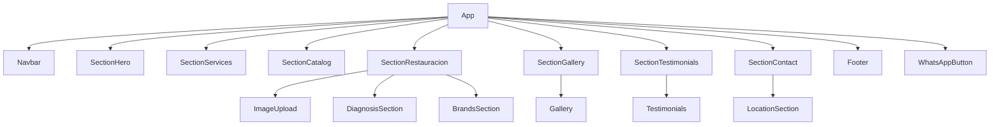

# Design Document: Artesanías, Antigüedades & Restauración — Landing Page

## Overview

El objetivo es expandir la landing page existente de "Restauración de Máquinas de Escribir" para convertirla en una landing page unificada que presente los tres pilares del negocio: **artesanías**, **antigüedades** y **restauración de máquinas de escribir**. Todo el contacto y cierre de ventas ocurre exclusivamente a través de WhatsApp; no existe carrito de compras ni procesamiento de pagos.

La arquitectura reutiliza al máximo los componentes existentes (`Gallery`, `ImageUpload`, `DiagnosisSection`, `LocationSection`, `BrandsSection`, `Testimonials`, `WhatsAppButton`) y agrega los componentes nuevos necesarios para las secciones faltantes. El proyecto usa React 18, TypeScript, Tailwind CSS v4, shadcn/ui y `motion/react`.

### Objetivos de diseño

- Mantener la identidad visual vintage (variables CSS `--vintage-*`) de manera consistente.
- Mínima fricción para llegar a WhatsApp desde cualquier punto de la página.
- Reutilización de componentes existentes, sin duplicación de lógica.
- Responsividad completa desde 320 px.
- Animaciones coherentes con `motion/react` (`whileInView`, `AnimatePresence`).

---

## Architecture

La aplicación es una **Single Page Application (SPA)** con React Router no necesario (una sola ruta `/`). La página se compone de secciones apiladas verticalmente; la navegación funciona mediante `scrollIntoView`.



### Flujo de datos

- El estado de imágenes subidas (`uploadedImages`, `showDiagnosis`) vive en `App` y se pasa a `SectionRestauracion`.
- Los datos del catálogo (productos de artesanías y antigüedades) se definen como constantes en sus respectivos módulos — no existe backend, es contenido estático.
- La generación de URLs de WhatsApp está centralizada en un helper `buildWhatsAppUrl(phone, message)`.
- El estado del menú hamburguesa vive localmente en `Navbar`.
- El efecto "sticky con fondo opaco" en `Navbar` se implementa con un listener de `scroll` + estado local.

---

## Components and Interfaces

### Componentes nuevos a crear

#### `Navbar`

```tsx
interface NavLink {
  label: string;
  sectionId: string;
}

interface NavbarProps {
  links: NavLink[];
  businessName: string;
}
```

- Estado local: `isScrolled: boolean`, `isMenuOpen: boolean`
- Agrega `window.addEventListener('scroll', ...)` en `useEffect`; elimina el listener en cleanup.
- Renderiza logo/nombre a la izquierda, links a la derecha en desktop, hamburger + menú desplegable en mobile.

#### `SectionHero`

```tsx
interface HeroProps {
  onScrollToDiagnosis: () => void;
}
```

- Muestra título de tres pilares, descripción ≤40 palabras, dos CTAs de WhatsApp.
- Reutiliza el fondo, overlay y estructura animada existente en `App.tsx`.

#### `SectionServices`

```tsx
interface ServiceCard {
  id: 'artesanias' | 'antiguedades' | 'restauracion';
  icon: LucideIcon;
  title: string;
  description: string; // ≤25 palabras
  whatsappMessage: string;
}
```

- Grid 3/2/1 columnas según breakpoint.
- El CTA usa `buildWhatsAppUrl` con mensaje específico por categoría.

#### `SectionCatalog`

```tsx
interface Product {
  id: string;
  name: string;
  description: string; // ≤20 palabras
  imageUrl: string;
  category: 'artesanias' | 'antiguedades';
}

interface ProductCardProps {
  product: Product;
  onContactWhatsApp: (productName: string) => void;
}
```

- Dos subsecciones separadas internamente.
- Grid responsivo 3/2/1.
- Imagen con fallback via `ImageWithFallback` ya existente (`src/app/components/figma/ImageWithFallback.tsx`).
- Aviso "Precios y disponibilidad por WhatsApp" en cada subsección.

#### `SectionRestauracion`

- Wrapper que engloba la lógica existente de diagnóstico.
- Muestra pasos del proceso (ya existe en `App.tsx` como "Features Section") y `BrandsSection`.
- Cuando `showDiagnosis === true`, muestra CTA de WhatsApp con mensaje de "diagnóstico completado".

#### `Footer` (reemplaza bloque inline de `App.tsx`)

```tsx
interface FooterProps {
  businessName: string;
  phone: string;
  email: string;
  address: string;
}
```

### Componentes existentes reutilizados

| Componente | Uso | Cambios requeridos |
|---|---|---|
| `Gallery` | `SectionGallery` | Ninguno |
| `ImageUpload` | `SectionRestauracion` | Ninguno |
| `DiagnosisSection` | `SectionRestauracion` | Ninguno |
| `LocationSection` | `SectionContact` | Ninguno |
| `BrandsSection` | `SectionRestauracion` | Ninguno |
| `Testimonials` | `SectionTestimonials` | Extender interfaz `Testimonial` para incluir `rating: number` y `serviceType: string` |
| `WhatsAppButton` | `App` (global) | Ninguno |
| `ImageWithFallback` | `ProductCard` | Ninguno |

### Helper: `buildWhatsAppUrl`

```ts
// src/app/utils/whatsapp.ts
export function buildWhatsAppUrl(phone: string, message: string): string {
  return `https://wa.me/${phone}?text=${encodeURIComponent(message)}`;
}
```

- `phone`: número sin `+` ni espacios (ej. `"56954095465"`)
- `message`: texto en español, sin encodear — la función lo encodea.

---

## Data Models

### Producto del catálogo

```ts
interface Product {
  id: string;          // UUID o slug
  name: string;
  description: string; // Máximo 20 palabras
  imageUrl: string;
  category: 'artesanias' | 'antiguedades';
}
```

### Testimonio (extensión del modelo existente)

```ts
interface Testimonial {
  name: string;
  role: string;
  quote: string;
  machine?: string;           // opcional, para restauraciones
  serviceType: 'artesanias' | 'antiguedades' | 'restauracion';
  rating: number;             // 1–5
}
```

### Tarjeta de servicio

```ts
interface ServiceCard {
  id: 'artesanias' | 'antiguedades' | 'restauracion';
  icon: LucideIcon;
  title: string;
  description: string;        // ≤25 palabras
  whatsappMessage: string;    // Mensaje predefinido para esa categoría
}
```

### Enlace de navegación

```ts
interface NavLink {
  label: string;
  sectionId: string;    // id del elemento HTML destino
}
```

### Constante de configuración de negocio

```ts
// src/app/config/business.ts
export const BUSINESS_CONFIG = {
  name: 'Taller Artesanal — GAM',
  phone: '56954095465',
  email: 'lucia.taller@gmail.com',
  address: 'Locales Artesanales junto al GAM, Av. Libertador Bernardo O\'Higgins 227, Santiago Centro',
} as const;
```

---

## Correctness Properties

*Una propiedad es una característica o comportamiento que debe mantenerse verdadero en todas las ejecuciones válidas del sistema — esencialmente, un enunciado formal sobre qué debe hacer el software. Las propiedades sirven como puente entre especificaciones legibles por humanos y garantías de corrección verificables automáticamente.*

Las propiedades se derivan de los criterios de aceptación identificados como **PROPERTY** en el análisis de prework. Los criterios de tipo EXAMPLE, EDGE_CASE, INTEGRATION y SMOKE se cubren con pruebas de ejemplo o inspección visual y no generan propiedades aquí.

---

### Property 1: Todos los CTAs de WhatsApp del Hero generan URLs válidas

*Para cualquier* CTA de WhatsApp presente en la `SectionHero`, el atributo `href` debe comenzar con `https://wa.me/56954095465?text=` y contener un mensaje codificado no vacío.

**Validates: Requirements 2.4**

---

### Property 2: Cada tarjeta de servicio tiene todos los campos requeridos y descripción corta

*Para cualquier* tarjeta de la `SectionServices`, la tarjeta debe contener un ícono, un título no vacío, una descripción cuyo conteo de palabras sea menor o igual a 25, y un botón/enlace de WhatsApp con href válido.

**Validates: Requirements 3.2**

---

### Property 3: El CTA de WhatsApp de cada tarjeta de servicio menciona su categoría

*Para cualquier* tarjeta de la `SectionServices` con una categoría dada (artesanías, antigüedades, restauración), el mensaje codificado en la URL de WhatsApp del CTA debe contener una referencia textual a esa categoría.

**Validates: Requirements 3.3**

---

### Property 4: Cada tarjeta de producto tiene todos los campos requeridos y descripción corta

*Para cualquier* objeto `Product` en el catálogo, renderizar su `ProductCard` debe producir un elemento que contenga una imagen (o placeholder), el nombre del producto, una descripción con conteo de palabras menor o igual a 20, y un botón "Consultar por WhatsApp".

**Validates: Requirements 4.2**

---

### Property 5: El CTA de WhatsApp de cada producto incluye el nombre del producto

*Para cualquier* producto con un nombre dado, el `href` del botón "Consultar por WhatsApp" de su `ProductCard` debe codificar un mensaje que contenga el nombre exacto de ese producto.

**Validates: Requirements 4.3**

---

### Property 6: Después del diagnóstico, el CTA de WhatsApp indica diagnóstico completado

*Para cualquier* conjunto de archivos de imagen subidos (al menos uno), una vez que se activa `showDiagnosis`, el WhatsApp_CTA visible en `SectionRestauracion` debe codificar un mensaje que indique que el usuario realizó el diagnóstico y desea solicitar un presupuesto.

**Validates: Requirements 5.5**

---

### Property 7: Cada elemento de la galería muestra modelo, año y descripción

*Para cualquier* ítem `GalleryItem` en el array de restauraciones, cuando ese ítem es el activo en `Gallery`, el panel de información debe mostrar el modelo, el año y la descripción de la restauración.

**Validates: Requirements 6.3**

---

### Property 8: Cada tarjeta de testimonio muestra todos los campos requeridos

*Para cualquier* objeto `Testimonial` con nombre, calificación, texto y tipo de servicio, renderizar su tarjeta de testimonio debe producir un elemento que contenga el nombre, la calificación en estrellas (representación visual de 1–5), el texto de la reseña y el tipo de servicio.

**Validates: Requirements 7.1**

---

## Error Handling

### Imágenes externas no disponibles

- `ImageWithFallback` ya gestiona el evento `onError` y renderiza un placeholder estilizado con el `Tema_Vintage`.
- Todos los `` en el catálogo deben pasar por `ImageWithFallback` para garantizar que un fallo no rompa el layout.

### Navegación sin sección destino

- Si el `sectionId` en un `NavLink` no corresponde a ningún elemento en el DOM, `scrollIntoView` simplemente no ejecuta nada. El helper de scroll debe envolver la llamada con una guarda `if (element)` para evitar errores silenciosos en consola.

```ts
function scrollToSection(id: string) {
  const el = document.getElementById(id);
  if (el) el.scrollIntoView({ behavior: 'smooth' });
}
```

### URLs de WhatsApp con mensajes vacíos

- `buildWhatsAppUrl` debe lanzar un error o retornar la URL base sin `?text=` si el mensaje es una cadena vacía, para evitar abrir WhatsApp con un mensaje en blanco. Se recomienda usar un mensaje genérico como fallback.

```ts
export function buildWhatsAppUrl(phone: string, message: string): string {
  const encodedMessage = encodeURIComponent(message.trim() || 'Hola, me gustaría obtener más información.');
  return `https://wa.me/${phone}?text=${encodedMessage}`;
}
```

### Menú hamburguesa: click fuera

- Se usa un listener de `mousedown` sobre `document` + `useRef` al contenedor del menú para detectar click fuera y cerrar el menú.

---

## Testing Strategy

### Evaluación de PBT

Este proyecto es una landing page React compuesta principalmente de **componentes de UI de renderizado** y **generación de URLs**. La mayoría de los criterios de aceptación son verificaciones estructurales (¿existe este elemento?) y no se benefician de property-based testing.

Sin embargo, **8 criterios** fueron clasificados como PROPERTY porque involucran lógica pura y repetible sobre conjuntos de datos:
- Generación de URLs de WhatsApp (se ejecuta para cualquier mensaje/producto/categoría).
- Validación de estructuras de datos de tarjetas (campos requeridos, longitud de texto).
- Comportamiento del componente `Gallery` para cualquier elemento del array.
- Renderizado de tarjetas de testimonio para cualquier objeto `Testimonial`.

Para estos, se aplica **property-based testing** con la librería **[fast-check](https://github.com/dubzzz/fast-check)** (compatible con Vitest/Jest, ampliamente mantenida).

### Pruebas unitarias / ejemplo

Para criterios clasificados como EXAMPLE y EDGE_CASE, se usan pruebas de ejemplo con **Vitest** + **@testing-library/react**:

- Navbar: renderizado de links, sticky behavior, hamburger menu toggle.
- SectionHero: presencia de tres pilares en título, conteo de palabras de descripción.
- SectionServices: exactamente 3 tarjetas, grid CSS.
- SectionCatalog: dos subsecciones, aviso de precios por WhatsApp.
- SectionRestauracion: presencia de `ImageUpload`, `DiagnosisSection`, pasos, marcas.
- SectionGallery: navegación anterior/siguiente, dots.
- SectionContact: dirección, horario, iframe de Maps, mailto.
- Footer: tres categorías, contacto, copyright.
- `ImageWithFallback`: placeholder al fallar carga.

### Pruebas de propiedad (fast-check)

Librería: **fast-check** (`^3.x`). Cada propiedad corre mínimo **100 iteraciones**.

Etiqueta de referencia: `Feature: artesanias-antiguedades-landing, Property {N}: {texto_de_la_propiedad}`

| Propiedad | Descripción del generador |
|---|---|
| P1 — URLs Hero válidas | Genera mensajes arbitrarios, verifica prefijo wa.me y mensaje no vacío |
| P2 — Campos de tarjeta de servicio | Itera sobre el array fijo de 3 servicios; verifica estructura |
| P3 — Mensaje incluye categoría | Genera categorías y verifica presencia en URL codificada |
| P4 — Campos de tarjeta de producto | Genera `Product` con `fc.record({name: fc.string(), description: fc.string()...})`, verifica estructura del render |
| P5 — Nombre de producto en URL | Genera nombre de producto arbitrario, verifica presencia en href codificado |
| P6 — Mensaje post-diagnóstico | Genera arrays de File simulados, verifica mensaje de presupuesto |
| P7 — Gallery muestra datos del ítem | Genera `GalleryItem[]`, verifica que el ítem activo muestra sus campos |
| P8 — Testimonio muestra todos los campos | Genera `Testimonial` con `fc.record(...)`, verifica render |

### Pruebas visuales / smoke

Los criterios de tipo SMOKE (tema vintage, animaciones, responsive mínimo) se validan mediante inspección visual manual en los breakpoints de 320 px, 640 px, 768 px, 1024 px y 1280 px usando las herramientas de DevTools del navegador.

### Estructura de archivos de prueba

```
src/
  app/
    utils/
      whatsapp.ts
      whatsapp.test.ts        ← P1, P3, P5, P6 (fast-check)
    components/
      navbar.test.tsx         ← Examples
      service-card.test.tsx   ← P2 (fast-check)
      product-card.test.tsx   ← P4 (fast-check)
      gallery.test.tsx        ← P7 (fast-check)
      testimonials.test.tsx   ← P8 (fast-check)
```
